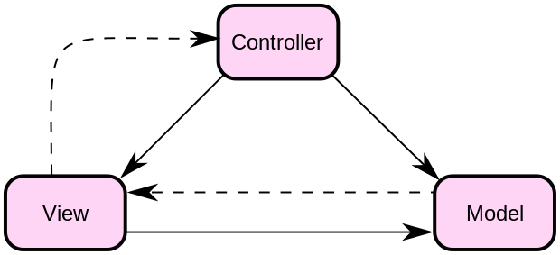
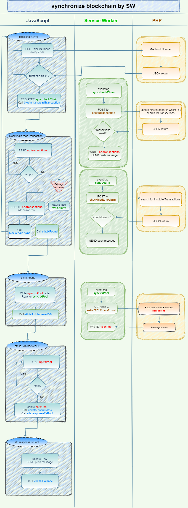
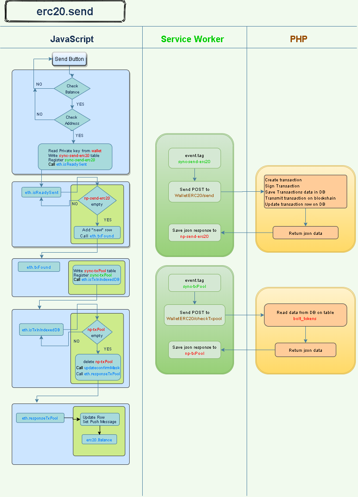

# Bolt Technical Manual

#### Repository

- Source code: https://bitbucket.org/jambtc/bolt/src/master
- Manuali utente: https://github.com/napoliblockchain/napay-docs

#### Librerie esterne

- Javascript Ethereum wallet: https://github.com/ConsenSys/eth-lightwallet
- JavaScript AES block cipher algorithm: https://github.com/ricmoo/aes-js
- Php interface with Ethereum blockchain: https://github.com/sc0Vu/web3.php
- Yii Framework: https://github.com/yiisoft/yii
- Librerie comuni alle applicazioni Napay (libs): https://bitbucket.org/jambtc/libs/src/master


<div style="page-break-after: always;"></div>


#### Il pattern MVC

Il software Bolt è costituito da parti di programma in php ed altre parti in Java e html. Viene utilizzato il framework Yii nella versione 1.1.20 per cui l'architettura è formata dal pattern MVC (Model-View-Controller) secondo l'immagine seguente:





Utilizzo il Framework yii perchè:
1. E' basato sul modello MVC
2. La gestione degli errori è molto semplice
3. Esiste una grande comunità per il supporto tecnico
4. Supporta il layered data caching, fragment caching, page caching, e il contenuto dinamico. Il supporto di memorizzazione nella cache può essere modificato
5. Migrazione dei dati semplificata
6. Caratteristiche di sicurezza

Normalmente, salvo forzature, nel controller e nel model viene gestita la programmazione php, mentre nelle view viene gestito il codice Javascript.
Il software è modulare, pertanto si possono estrarre singole porzioni che possono essere implementate o modificate a seconda delle proprie necessità.
Il software è stato implementato anche con funzioni PWA (Progressive Web App), pertanto saranno attivi anche moduli Javascript quali il service worker (SW). La PWA permette anche la gestione dei messaggi Push.
Viene, inoltre, utilizzato `l'indexedDb`, lo storage locale del browser, al cui interno vengono salvati ad esempio il pin di sicurezza, il seed e le informazioni di invio token. Il local storage viene utilizzato per questione di sicurezza quale il salvataggio in locale dei dati dell'utente, questo per evitare che essi siano salvati sul server centrale. In tal modo l'utente è l'unico responsabile della conservazione e trattazione delle proprie informazioni di sicurezza relative al wallet. Questo evita anche che il gestore del server possa essere chiamato in causa per questioni relative al salvataggio e ripristino dei token di un utente.


<div style="page-break-after: always;"></div>

#### Il modulo di Login

Il login all'applicazione può essere effettuato in quattro diverse modalità. La soluzione classica è quella di effettuare la registrazione di username e password ed usare queste due componenti per utilizzare il wallet. È stato previsto anche l'utilizzo di social per effettuare il login ed in particolare si possono usare gli account social di:

- Facebook
- Telegram
- Google

Le librerie per l'utilizzo di questi social ho pensato di non integrarle, ma di creare un repository esterno che ho chiamato [**libs/oauth**](https://bitbucket.org/jambtc/libs/src/master/oauth/) così da poterle utilizzare anche per altre applicazioni. Ecco un esempio di utilizzo della libreria:

```php
<?php
include ('js_login.php');
include ('js_google.php');
include ('js_facebook.php');

require_once Yii::app()->params['libsPath'] . '/oauth/telegram/login.php';
$checkTelegramAuthorization = Yii::app()->createUrl('telegram/CheckAuthorization');
$bot_username = Settings::load()->telegramBotName;
$bot_token = Settings::load()->telegramToken;

require_once Yii::app()->params['libsPath'] . '/oauth/google/login.php';
$checkGoogleAuthorization = Yii::app()->createUrl('google/CheckAuthorization');

require_once Yii::app()->params['libsPath'] . '/oauth/facebook/login.php';
$facebookAppID = $settings->facebookAppID;
$facebookAppVersion = $settings->facebookAppVersion;
$sourceLanguage = explode('_',Yii::app()->sourceLanguage);
$lingua = $sourceLanguage[0];
$paese = strtoupper($sourceLanguage[1]);
```


<div style="page-break-after: always;"></div>

#### Il controller del wallet

Andiamo ora a vedere come è gestita la creazione/verifica del wallet a seconda che si utilizzi il software per la prima volta o in quelle successive.

Una volta effettuato il login tramite il modulo di Login, il walletController verifica se nella tabella `bolt_wallets` (gestita dalla classe protected\models\Wallet.php) è presente un address appartenente allo user connesso. Se non è presente inizializza la variabile *$from_address* al valore di 0x00...  altrimenti assegna il valore caricandolo dal db.

file: *`protected/Controllers/WalletController.php`*

```php
<?php
// carico il wallet selezionato nei settings
$settings=Settings::loadUser(Yii::app()->user->objUser['id_user']);
if (empty($settings->id_wallet)){
  $from_address = '0x0000000000000000000000000000000000000000';
}else{
  $wallet = Wallets::model()->findByPk($settings->id_wallet);
  $from_address = $wallet->wallet_address;
}
$modelc->from_address = $from_address;
```

Carico i contatti

```php
<?php
// carico i contatti dell'utente
$criteria = new CDbCriteria();
$criteria->compare('id_user',Yii::app()->user->objUser['id_user'],false);
$dataProvider=new CActiveDataProvider('Contacts',array(
  'criteria' => $criteria,
  'pagination' => array(
    'pageSize' => 10,
  ),
));

```

Quindi viene richiesto di mostrare la schermata principale del wallet con le informazioni necessarie al suo corretto funzionamento.

```php
<?php
// visualizzo la schermata
$this->render('index',array(
  'modelc'=>$modelc, //lista transazioni tokens
  'walletForm'=>$walletForm, //form per invio dati
  'from_address'=>$from_address, // indirizzo del wallet dell'utente
  'actualBlockNumberDec' => eth::latestBlockNumberDec(), // blocco attuale su blockchain
  'dataProvider' => $dataProvider, // lista contatti
));
```

Finora il software ha lavorato lato server.


<div style="page-break-after: always;"></div>

#### La view principale (wallet/index)

La view mostra la maschera principale e carica diversi file Java. In Yii è possibile generare dinamicamente i file Java, cosa molto utile perché così è possibile modificarne i parametri a seconda delle diverse richieste di funzionamento.

file: *`protected/views/wallet/index.php.php`*

```php
<div class="form">

<?php
$form=$this->beginWidget('CActiveForm', array(
  'id'=>'wallet-form',
  'enableAjaxValidation'=>false,
));

//richiamo tutte le funzioni javascript
include ('js_pin.php');
include ('js_eth.php'); // viene prima di initialize
include ('js_walletInitialize.php');
include ('js_wallet.php');
include ('js_cgridview.php');
include ('js_qr-scanner.php');
include ('js_nfc.php');
```

Il file che gestisce la generazione del seed è *`protected/views/wallet/js_walletInitialize.php`*

Una funzione  interviene per verificare che all'interno dello storage del browser ci sia salvato l'address inviato dal Controller e reagisce in questo modo:

- address non salvato: vai a generazione seed
- address trovato ma diverso: vai a generazione seed
- address trovato e identico: carica il resto della pagina

```javascript
// LEGGO LE INFORMAZIONI DEL WALLET DA IndexedDB
var isEquel = null;
var my_address;

readFromId('wallet',"{$from_address}")
  .then(function(data) {
    if (typeof data[0] !== 'undefined') {
      for (var dt of data) {
        if (null === data.id){
          $('#initializeWallet').modal({backdrop: 'static',keyboard: false});
          break;
        }else{
          var address_1 = new String("{$from_address}");
          var iduser_1 = new String(cryptedIdUser);
          var address_2 = new String(dt.id);
          var iduser_2 = new String(dt.id_user);
          isEquel_1 = JSON.stringify(address_1) === JSON.stringify(address_2);
          isEquel_2 = JSON.stringify(iduser_1) === JSON.stringify(iduser_2);
          isEquel = isEquel_1 * isEquel_2;
        }
        if ( isEquel ){
          /*  START 	*/
          my_address = data[0].id;
          break;
        }else{
          $('#initializeWallet').modal({backdrop: 'static',keyboard: false});
          break;
        }
      }
      ...
```


<div style="page-break-after: always;"></div>

#### Generazione del seed

Viene visualizzata una finestra Modal dove inserire e/o generare un nuovo seed. La pagina di layout *`protected/views/layout/main.php`* carica il file Javascript lightwallet.min.js (https://github.com/ConsenSys/eth-lightwallet) che è, in breve, la libreria che permette la generazione e il salvataggio delle chiavi private ethereum.


La funzione <span style="color:blue;">**keystore.generateRandomSeed()**</span> genera un seed con entropia casuale di lunghezza variabile da 1000 a 2000 caratteri.

```javascript
// questa funzione genera il nuovo seed del wallet
function newWallet()
{
  seed = lw.keystore.generateRandomSeed(generateEntropy(Math.floor(Math.random() * 1001)+1000));
  testo = "<p class='alert alert-light text-danger'><strong>"+seed+"</strong></p>";
  testo += Yii.t('js',"<b>Write the seed and keep it in a safe place; if you lose it you will not be able to restore your wallet and you will lose all the funds.</b>");

  $('#seedText').html(testo);
  $('#seedInput').val(seed);
}
```

Premendo il pulsante di salvataggio del seed, viene verificata la validità dello stesso e la funzione <span style="color:blue;">**generateEntropy()**</span> genera anche una password di 32 caratteri per criptare il seed prima di effettuare la chiamata alla funzione <span style="color:blue;">**initializeVault()**</span> che inizializza il wallet.

```javascript
// verifico validità del seed
$("button[id='cryptConferma']").click(function(){
  var seed = $('#seedInput').val();
  var confirm_seed = $('#repeat_seed').val();

  if (WordCount(confirm_seed) != 12 || !(isSeedValid(confirm_seed)) || confirm_seed != seed){
    $('#repeat_seed_em_').show().text(Yii.t('js','Invalid Seed!'));
    return;
  }
  $('#repeat_seed_em_').hide().text('');

  // la password viene generata in automatico dal sistema
  var password = generateEntropy(32);
  initializeVault(password,seed);
});
```

Nella funzione <span style="color:blue;">**initializeVault()**</span>:

- La password e il seed vengono criptati e viene richiamata la funzione <span style="color:blue;">**keystore.createVault()**</span>.
- Dalla password e dal seed viene estratta la Derived Key con cui viene generato ed estratto l'address n. 0
- Con address e derived key viene  esportata la chiave privata
- Address e chiave privata criptata vengono salvati in `indexedDb` del browser nella tabella wallet.
- Address viene salvato nella tabella mysql **bolt_wallets**
- *id_address* relativo alla tabella **bolt_wallets** viene salvato nei settings dell'user
- Il seed viene salvato criptato in `indexedDb` del browser nella tabella **<span style="color:red;">mseed</span>**
- La pagina viene ricaricata e si ripete il processo dall'inizio

```javascript
// adesso salviamo in local storage il seed e la password
function initializeVault(password, seed) {
  $.ajax({
    url:'{$cryptURL}',
    type: "POST",
    data: {
    	'pass': password,
    	'seed': seed
    },
    dataType: "json",
    success:function(data){
      var pwd_crypted = data.cryptedpass;
      var seed_crypted = data.cryptedseed;
      var iduser_crypted = data.cryptediduser;
      lw.keystore.createVault({
        password: password,
        seedPhrase: seed,
        hdPathString: "m/0'/0'/0'"
      }, function (err, ks) {
        ks.keyFromPassword(password, function (err, pwDerivedKey) {
          if (!ks.isDerivedKeyCorrect(pwDerivedKey)) {
            throw new Error("Incorrect derived key!");
          }
          try {
            ks.generateNewAddress(pwDerivedKey, 1);
          } catch (err) {
            console.log(err);
            console.trace();
          }
          var address = ks.getAddresses()[0];
          var prv_key = ks.exportPrivateKey(address, pwDerivedKey);
          var post = {
            id      : address, // id of indexedDB
            id_user : iduser_crypted,
            prv_php : CryptoJS.AES.encrypt(JSON.stringify(prv_key), password, {format: CryptoJSAesJson}).toString(),
            prv_pas : pwd_crypted,
          };
          writeData('wallet', post).then(function() {
            //save at mysql a user's wallet address
            $.ajax({
              url : '{$saveAddress}',
              type: "POST",
              data: {'address': address},
              dataType: "json",
              success:function(data){
                var post2 = {
                  id : new Date().toISOString(), // id of indexedDB
                  cryptedseed : seed_crypted,
                }
                writeData('mseed', post2).then(function() {
                  setTimeout(function(){ location.reload() }, 250);
                });
              },
              error: function(j){
                console.log('error',j);
              }
            });
          })
          .catch(function(err) {
          	console.log(err);
          });
        });
      });
      // Quindi, chiedo di installare la webapp sulla home del cell
      saveOnDesktop();
    },
    error: function(j){
      console.log('error',j);
    }
  });
}
```

<div style="page-break-after: always;"></div>

#### Seed già generato e address trovato negli User Settings

Quando l'utente effettua il login, abbiamo visto che il software controlla se nell'`indexedDb` è presente lo stesso address salvato nei settings dell'user richiamando, in caso di diversità, il processo di generazione del seed. Nel caso in cui siano uguali vengono richiamati i processi che possiamo anche vedere nel blocco di codice che segue:

```javascript
.then(function() {
  if (isEquel){
    backend.checkPin();
    erc20.Balance(my_address);
    eth.Balance(my_address);
    blockchain.sync(my_address);
    setTimeout(function(){ blockchain.scanForNew(my_address) }, 2000);
  }
});
```

Viene eseguita la funzione <span style="color:blue;">**backend.checkPin()**</span> per verificare che sia stato immesso il pin per sbloccare l'applicazione. Anche il pin è salvato in formato criptato nell'`indexedDb` nella tabella pin.

Vengono chiamate le funzioni <span style="color:blue;">**erc20.Balance()**</span> e <span style="color:blue;">**eth.Balance()**</span> (inserite nel file *`js_eth.php`*) che verificano sulla blockchain il saldo sull'address.

Vengono poi chiamate due funzioni che sincronizzano la blockchain in questo modo:

##### <span style="color:blue;">**blockchain.sync()**</span>:

Ricerca nei nuovi blocchi transazioni in cui sia presente l'address dell'utente. Nei prossimi paragrafi spiegherò nel dettaglio il funzionamento delle funzioni che si interfacciano con la blockchain Ethereum. Per il momento basti sapere che nella nostra POA, generalmente, ciascun blocco viene generato ogni 15 secondi, quindi questa funzione viene richiamata ogni 7 secondi secondo la formula seguente:

- (T2 - T1) / E dove
  - t2-t1 è l'intervallo di tempo di 15 secondi
  - E è il numero di eventi certi che desideriamo accadano
  - Quindi abbiamo (15 - 0) / 2 = 7,5 arrotondata a 7 secondi

##### <span style="color:blue;">**blockchain.scanForNew()**</span>:

Cerca nel db eventuali transazioni nello stato "**new**" e, nel caso in cui è presente la txhash (hash della transazione), verifica sulla blockchain lo stato della stessa aggiornando di conseguenza il db. Nel caso in cui la txhash è vuota la transazione viene segnalata come "<span style="color:red;">**failed**</span>". In pratica questa funzione agisce da "resume" nel caso in cui il software del wallet si sia bloccato o lo smartphone abbia avuto problemi di qualsiasi genere.


<div style="page-break-after: always;"></div>

#### Funzione erc20.Balance

file: *`protected/controllers/WalletERC20Controller.php`*

Con una chiamata ajax al server (<span style="color:brown;">**getBalance**</span>) viene eseguita la connessione alla blockchain e caricato il bilancio token. Quindi vengono restituiti i valori in formato json e viene dinamicamente aggiornato il campo del balance.

```php
public function actionGetBalance(){
  $my_address = $_POST['my_address'];

  //carico le impostazioni dell'applicazione
  $settings=Settings::load();
  if ($settings === null){
    echo CJSON::encode(array(
      "error"=>'Error: Token configuration parameters were not found',
      "id"=>time()
    ));
    exit;
  }
  self::setDecimals($settings->poa_decimals);
  $poaNode = WebApp::getPoaNode();
  if (!$poaNode){
    $save = new Save;
    $save->WriteLog('bolt','walletERC20','getBalance',"All Nodes are down.");
  }else{
    $web3 = new Web3($poaNode);
    $contract = new Contract($web3->provider, $settings->poa_abi);
    $utils = $web3->utils;

    $contract->at($settings->poa_contractAddress)->call('balanceOf', $my_address, [
          'from' => $my_address
        ], function ($err, $result) use ($contract, $utils) {
          if ($err !== null) {
            echo CJSON::encode(array(
              "error"=>$err->getMessage(),
              'id'=>time()
            ));
            exit;
          }
          if (isset($result)) {
            $value = $utils->fromWei($result[0]->value, 'ether');
            $Value0 = (string) $value[0]->value;
            $Value1 = (float) $value[1]->value / pow(10,self::getDecimals());
            self::setbalance($Value0 + $Value1);
          }
        }
    );
  }
  $send_json = array(
    'balance' => self::getBalance(),
    'id'=> $my_address,
  );
  echo CJSON::encode($send_json);
}
```


<div style="page-break-after: always;"></div>

#### Funzione eth.Balance

file: *`protected/controllers/WalletETHController.php*`

Con una chiamata ajax al server (<span style="color:red;">**getBalance**</span>) viene eseguita la connessione alla blockchain e caricato il bilancio ethereum dell'address. Quindi vengono restituiti i valori in formato json, ma in questo caso non viene dinamicamente aggiornato il campo del balance in quanto invisibile. Il caricamento di questa informazione è necessaria nella POA dove bisogna possedere eth, cioè il gas per poter effettuare l'invio di transazioni token. Se il gas è 0, sempre tramite una chiamata Ajax al server, viene eseguita una funzione (<span style="color:red;">**loadGAS**</span>) che carica di 1 eth il wallet dell'utente. I parametri relativi al wallet sender sono configurabili nel menù impostazioni della webapp Napay esclusivamente da parte dell'amministratore.

**Nel caso di POA gas free, questa funzione deve essere disabilitata.**

```php
public function actionGetBalance(){
  $my_address = $_POST['my_address'];

  //carico le impostazioni dell'applicazione
  $settings=Settings::load();
  if ($settings === null){
    echo CJSON::encode(array(
      "error"=>'Error: Token configuration parameters were not found',
      'id'=>time(),
      'balance'=>0,
    ));
  	exit;
  }
  $poaNode = WebApp::getPoaNode();
  if (!$poaNode){
    $save = new Save;
    $save->WriteLog('bolt','walletETH','getBalance',"All Nodes are down.");
  }else{
    $web3 = new Web3($poaNode);
    $eth = $web3->eth;
    $balance = 0;
    // recupero il balance
    $web3->eth->getBalance($my_address, function ($err, $balance) use ($balance){
      if ($err !== null) {
        echo CJSON::encode(array(
          "error"=>$err->getMessage(),
          'id'=>time(),
          'balance'=>0,
        ));
        exit;
      }
      $balance = $balance->toString();
    });
  }
  $send_json = array(
    'balance' => $balance,
    'id'=> $my_address,
	);
  echo CJSON::encode($send_json);
}
```


<div style="page-break-after: always;"></div>

#### Funzione blockchain.sync

file: *`protected/controllers/BlockchainController.php`*

Questa funzione (<span style="color:brown;">**scanForTransactions**</span>) cerca nella blockchain le transazioni relative al wallet address principale partendo dall'ultimo block number sincronizzato nel wallet. Una chiamata ajax invia al server la richiesta di ricerca ed attende la risposta dal server.

La ricerca nel Controller avviene in questo modo:

- Carica il blockNumber relativo al wallet da mysql nella tabella **bolt_wallets**
- Cerca nei blocchi successivi fino al valore *$maxBlocksToScan* (impostato nei settings della webapp a 500)
- Se non trova nulla, aggiorna esclusivamente il Wallet al blocco sopraggiunto in db ed esce
- Se trova una o più transazioni:
  - Recupero il txhash della transazione
  - Verifico la presenza txhash in db per quel wallet
  - Se non è presente genero la transazione nel db
  - Salvo nel db del wallet l'ultimo blocco cercato
  - Se l'indirizzo di invio appartiene ad un Istituto registrato nell'app, predispongo invio Allarme


La risposta in formato json viene gestita in questo modo:

- Viene visualizzata a video una nuova riga "new transaction" modificando il DOM della tabella transazioni
- Viene predisposto invio messaggio Push
- Se l'indirizzo di invio appartiene ad un Istituto iscritto nella webapp Napay, registro nel service worker (SW) l'evento <span style="color:green;">**sync-alarm**</span> per il countdown per l'allarme previsto per il Covid-19
- Registro nel SW l'evento <span style="color:green;">**sync-txPool**</span>


La funzione <span style="color:blue;">**backend.checkNotify()**</span> presente nel file *`js_backend.php`* intercetta la modifica nel db e:

- Suona l'allarme
- Visualizza notifica


Il SW intercetta l'evento <span style="color:green;">**sync-alarm**</span> e alla scadenza del countdown:

- Invia messaggio di allarme push
- Salva nel db messaggio di notifica con il testo del messaggio predisposto per l'Istituto corrispondente


Il SW intercetta l'evento di sincronizzazione <span style="color:green;">**sync-txPool**</span> e:

- effettua la richiesta POST al server all'indirizzo <span style="color:brown;">**WalletERC20/checkTxPool**</span>

  ```javascript
  // SINCRONIZZAZIONE RICEZIONE
  if (event.tag === 'sync-txPool') {
    event.waitUntil(
      readAllData(event.tag).then(function(data) {
        for (var dt of data) {
          var postData = new FormData();
          postData.append('id_token', dt.id_token);
          fetch(dt.url, {
            method: 'POST',
            body: postData,
          })
          .then(function(response) {
            return response.json();
          })
          .then(function(json) {
            writeData('np-txPool', json);
          })
          .catch(function(err){
            console.log('[Service worker] Error while checking pool data', err);
          })
        }
        // per sicurezza cancello tutto da indexedDB
        clearAllData(event.tag);
      })
    );
  }
  ```

- Salva la risposta in formato json nella tabella `indexedDb` <span style="color:red;">**np-txPool**</span>. Gli stati possono essere:

  - New
  - Completed
  - Failed


Nel controller a seguito della chiamata alla funzione <span style="color:brown;">**WalletERC20/checkTxPool**</span> vengono effettuate le operazioni seguenti:

- Legge dal db la riga della transazione token

- Restituisce la risposta in formato json

  ```php
  <?php
  /**
  * Questa funzione controlla lo stato della transazione token
  * Viene interrogato dal SW dopo che è stato registrata la richiesta in 'sync-txPool'
  * La risposta viene salvata in indexedDB dal SW
  * @param POST
  * @param integer id_token the ID of the model to be searched
  * @return json
  */
  public function actionCheckTxpool(){
  $model = $this->loadModel(crypt::Decrypt($_POST['id_token']));
  $wallets = Wallets::model()->findByAttributes(['id_user'=>Yii::app()->user->objUser['id_user']]);

  echo CJSON::encode(array(
    'id' => time(), //NECESSARIO PER IL SALVATAGGIO IN  indexedDB quando ritorna al Service Worker
    "status"=>$model->status,
    "status_wlink"=>WebApp::translateMsg($model->status),
    "openUrl"=>Yii::app()->createUrl('tokens/view',array('id'=>crypt::Encrypt($model->id_token))), // url per i messaggi push
    'to_address'=>$model->to_address,
    'from_address'=>$model->from_address,
    'token_price'=>$model->token_price,
    'token_price_wsymbol' => WebApp::typePrice($model->token_price,($model->from_address == $wallets->wallet_address ? 'sent' : 'received')),
    'id_token'=>$_POST['id_token'],
  ));
  }
  ```


La funzione <span style="color:blue;">**eth.isTxInIndexedDB()**</span> si occupa di leggere la tabella <span style="color:red;">**np-txPool**</span> predisposta dal SW tramite l'evento <span style="color:green;">**sync-txPool**</span> e reagisce a seconda dello stato della transazione. Solo se questa è diversa da "**new**" allora:

- Se la tabella è vuota richiama se stessa ogni 50 msec

- Altrimenti svuota la tabella <span style="color:red;">**np-txPool**</span>

- Chiama la funzione <span style="color:blue;">**eth.responseTxPool()**</span> che:

  - Modifica nel DOM la riga relativa alla transazione aggiornando il contenuto della transazione

  - Predispone l'invio della notifica push

  - Aggiorna il bilancio del wallet richiamando la funzione <span style="color:blue;">**erc20.Balance()**</span>

    ```javascript
    // verifica che ci siano transaz. in indexedDB
    isTxInIndexedDB: function(id_token){
      readAllData('np-txPool').then(function(data){
        if (typeof data[0] !== 'undefined') {
          clearAllData('np-txPool');
          eth.responseTxPool(data[0]);
        }else {
          maxRepeat ++;
          if (maxRepeat <7200)
            setTimeout(function(){ eth.isTxInIndexedDB(id_token) }, 50);
        }
      });
    },

    // analizza la risposta da txpool
    responseTxPool: function(data){
      if (data.status !== 'new'){
        // modify DOM
  		...
        // set Push Message
        displayNotification(options);

        setTimeout(function(){
          erc20.Balance('{$from_address}')
        }, 1000);
      }else{
        setTimeout(function() {
          eth.txFound(data.id_token);
        }, 1000);
      }
    },
    ```


**Note**: *i messaggi push vengono ricevuti dall'utente solo se egli ha attivato ed accettato l'utilizzo nella relativa funzione "**Messaggi push**" nel menù Impostazioni dell'applicazione.*


<div style="page-break-after: always;"></div>

##### blockchain.sync Workflow



<div style="page-break-after: always;"></div>

#### Servizio WT (watch tower)

file: *`protected/commands/wtCommand.php`*

Un discorso a parte è previsto per il servizio WT watch tower o Torre di guardia. Questo servizio è eseguita in maniera indipendente sul server ed è una funzione php trasformata in un vero e proprio servizio Linux.

La sua funzione è quella di monitorare le transazioni all'interno dei singoli blocchi e laddove queste non fossero aggiornate all'interno del db della webapp, provvede ad effettuare gli aggiornamenti e ad inviare notifiche push a chi ***riceve*** Token, mentre l'applicazione non è aperta sullo smartphone.

Questo rende possibile poter, ad esempio, chiudere immediatamente il wallet subito dopo aver inviato dei token. La chiusura del wallet potrebbe anche avvenire per un guasto dello smartphone o perché si è scaricata la batteria.

Abbiamo visto che quando effettuo il login nel wallet una tra le prime funzioni ad essere richiamate è <span style="color:blue;">**blockchain.sync()**</span>, che verifica l'ultimo blocco in cui è stato utilizzato e da quello parte alla ricerca di transazioni legate all'address dell'utente. Nel caso di arresto improvviso del telefono subito dopo la fase di invio token, questo potrebbe rendere non congruente il saldo token con la lista di transazioni del wallet. Il WT evita che questo accada. Scrive in un registro log (leggibile dall'amministratore in Napay) tutte le operazioni effettuate e le transazioni trovate ed aggiorna il db in maniera indipendente dal wallet. Alla sua riattivazione dopo un blocco il wallet potrà visualizzare le informazioni corrette perché queste saranno state portate a termine dal WT e non dal Javascript del wallet.


<div style="page-break-after: always;"></div>

#### Funzione erc20.Send

file: *`protected/controllers/WalletERC20Controller.php`*

Questa funzione (<span style="color:brown;">**send**</span>) invia ad un indirizzo specificato il numero di token indicati nella pagina form di inserimento dati.

Prima di eseguire la chiamata ajax al server, la funzione <span style="color:blue;">**erc20.send()**</span> verifica che:

- l'importo da inviare sia inferiore o uguale al saldo token

- l'indirizzo di ricezione sia un indirizzo valido. Uno storico di indirizzi verificati viene salvato nella tabella di `indexedDb` <span style="color:red;">**np_checkaddress**</span> per velocizzare il processo di verifica. Altrimenti viene effettuata una richiesta ajax che verifica la correttezza dell'indirizzo

  ```javascript
  var isAddressChecked = false;
  //check if valid address is in cache
  if ('indexedDB' in window) {
    readAllData('np_checkaddress').then(function(data) {
      for (var dt of data) {
        if (dt.id == $('#WalletTokenForm_to').val()){
          if (dt.response != true){
            $('#WalletForm_to_em_').show();
            $('#WalletForm_to_em_').text(Yii.t('js','Wrong destination address.'));
            flagError = true;
          }else{
            isAddressChecked = true;
            $('#WalletForm_to_em_').hide();
          }
        }
      }
      });
  }
  if (!isAddressChecked){
    $.ajax({
      url:'{$urlCheckAddress}',
      type: "POST",
      data:{
        'to'	: $('#WalletTokenForm_to').val(),
      },
      dataType: "json",
      success:function(data){
        if (data.response===true){
          $('#WalletForm_to_em_').hide();
          prosegui();
        }else{
          $('#WalletForm_to_em_').show();
          $('#WalletForm_to_em_').text(Yii.t('js','Wrong destination address.'));
          flagError = true;
        }
      },
      error: function(j){
        $('#WalletForm_to_em_').show();
        $('#WalletForm_to_em_').text(Yii.t('js','Unable to verify destination address.'));
        flagError = true;
      }
    });
  }
  ```

- valuta il gas stimato tramite un'altra richiesta ajax al server

  ```javascript
  $.ajax({
    url:'{$urlEstimateGas}',
    type: "POST",
    data:{
      'from'  : $('#WalletTokenForm_from').val(),
      'to'    : $('#WalletTokenForm_to').val(),
      'amount': $('#WalletTokenForm_amount').val(),
    },
    dataType: "json",
    success:function(data){
      gasPrice = data.gasPrice;
      showProsegui();
    },
    error: function(j){
      console.log(j);
    }
  });
  ```

- Legge la private key e la password criptate da `indexedDb` dalla tabella <span style="color:red;">**wallet**</span>

- Scrive nella tabella <span style="color:red;">**sync-send-erc20**</span> la private key e la password e tutti gli altri parametri **POST**

- Registra nel SW l'evento <span style="color:green;">**sync-send-erc20**</span>

- Chiama la funzione <span style="color:blue;">**eth.isReadySent()**</span>

- Ripristina la schermata principale del wallet ed inizializza le variabili allo stato nativo tramite <span style="color:blue;">**updateconfirmMask()**</span>


##### La funzione <span style="color:blue;">**eth.isReadySent()**</span>:

- legge la tabella <span style="color:red;">**np-send-erc20**</span> predisposta dal SW che avrà intercettato l'evento <span style="color:green;">**sync-send-erc20**</span> spiegato più avanti

- Se la tabella è vuota la funzione auto-richiama se stessa ogni 500 msec

- In caso di errore nella transazione mostra a video l'errore

- Aggiunge al DOM nella tabella transazioni una nuova riga con le relative informazioni

  ```javascript
  // controlla se il db di ricezione indexedDB è stato preparato dal service worker
  isReadySent: function(suffix){
    readAllData('np-send-'+suffix).then(function(data) {
      if (typeof data[0] !== 'undefined') {
        if (data[0].error){
          $('.sufee-alert').show().addClass( "alert alert-warning" );
          $('#errorMessageOnSend').html('<small>'+data[0].error+'</small>');
          $('#errorMessage').html('<small>'+data[0].error+'</small>');
        }else{
          $('#tokenConfirm').show();
          $('.bitpay-pairing__loading').remove();
          $('#scrollmodalGas').modal('hide');
          for (var dt of data) {
            eth.addNewRow(dt);
            eth.txFound(dt.id_token);
          }
        }
        clearAllData('np-send-'+suffix);
      }else{
        setTimeout(function(){ eth.isReadySent(suffix) }, 500);
      }
  });
  },
  ```

- Esegue una chiamata alla funzione <span style="color:blue;">**eth.txFound()**</span>

- Svuota il contenuto della tabella `indexedDb` <span style="color:red;">**np-send-erc20**</span>


##### La funzione <span style="color:blue;">eth.txFound()</span>:

- Scrive nella tabella `IndexedDb` <span style="color:red;">**sync-txPool**</span> l'id della transazione
- Registra nel SW l'evento di sincronizzazione <span style="color:green;">**sync-txPool**</span> che abbiamo già spiegato nella funzione <span style="color:blue;">**blockchain.sync()**</span>
- Chiama la funzione <span style="color:blue;">**eth.isTxInIndexedDB()**</span> che abbiamo già spiegato nella funzione <span style="color:blue;">**blockchain.sync()**</span>


Il SW intercetta l'evento di sincronizzazione <span style="color:green;">**sync-send-erc20**</span> e:

- effettua la richiesta POST al server all'indirizzo <span style="color:brown;">**WalletERC20/send**</span>
- Salva il contenuto in formato json nella tabella `indexedDb` <span style="color:red;">**np-send-erc20**</span>

```javascript
// SINCRONIZZAZIONE INVIO
if (event.tag === 'sync-send-erc20') {
  event.waitUntil(
    readAllData(event.tag).then(function(data) {
      for (var dt of data) {
        var postData = new FormData();
            postData.append('from', dt.from);
            postData.append('to', dt.to);
            postData.append('gas', dt.gas);
            postData.append('amount', dt.amount);
            postData.append('memo', dt.memo);
            postData.append('prv_key', dt.prv_key);
            postData.append('prv_pas', dt.prv_pas);

        fetch(dt.url, {
          method: 'POST',
          body: postData,
        })
        .then(function(response) {
          return response.json();
        })
        .then(function(json) {
          writeData('np-send-'+suffix, json);
        })
        .catch(function(err){
          console.log('[Service worker] Error while sending data', err);
        })
      }
      //per sicurezza cancello tutto da indexedDB
      clearAllData(event.tag);
   })
  );
}
```


Nel controller a seguito della chiamata alla funzione <span style="color:brown;">**WalletERC20/send**</span> vengono effettuate le operazioni seguenti:

- Viene creata la transazione con smart contract
- Viene firmata la transazione con i dati inviati via POST
- Viene creata sul db una riga contenente i dati della transazione token
- Viene trasmessa la transazione token sulla blockchain
- Viene aggiornata la transazione sul db con le informazioni ricevute dalla blockchain
- Viene salvato il messaggio di notifica e inviato tramite funzione Push
- Si restituiscono le informazioni in formato json alla chiamata del SW


<div style="page-break-after: always;"></div>


##### Send Workflow



