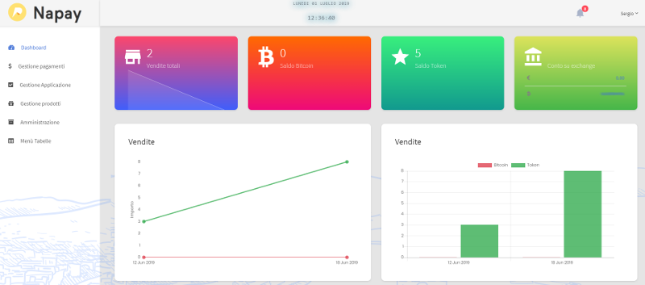
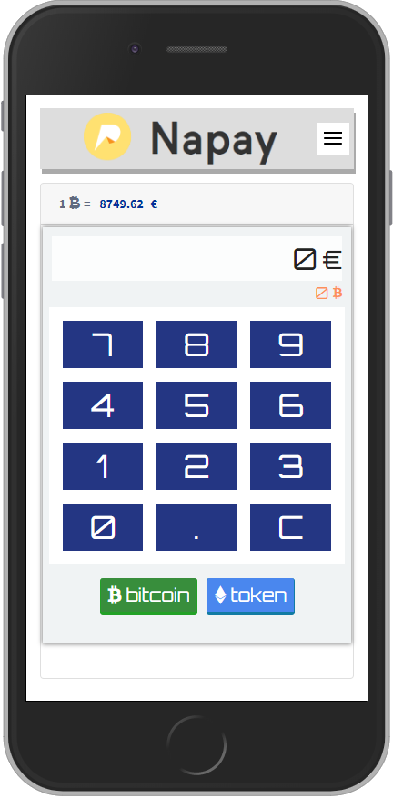

# Napay

### Progressive Web App - v. 1.4

Napay è un'applicazione web nata per gestire facilmente i pagamenti in bitcoiin e in TTS, il Token del Comune di Napoli.

### Authors

Made with :heart: ​by [Sergio Casizzone](https://sergiocasizzone.it)

## Indice

[TOC]

## Premessa

Napay (acronimo di Napoli Payments) è un software sviluppato all'interno del Progetto Blockchain Napoli da volontari e appassionati, di consolidata esperienza nei vari ambiti tecnologici (programmatori, sistemisti, ecc.), la cui sinergia ha fornito le basi per la creazione di un nuovo sistema di pagamento per le attività commerciali ed i professionisti.

#### Progetto Blockchain Napoli

Nel mese di aprile 2018, il Comune di Napoli ha effettuato una chiamata pubblica per il reclutamento di volontari al fine di realizzare alcuni progetti in ambito blockchain e cryptovalute. A questa chiamata hanno risposto piú di 300 persone. Per quanto riguarda i pagamenti in cryptovaluta, si è formato un ristretto gruppo di tecnici il cui obiettivo è stato la realizzazione di un sistema di pagamento virtuale che permetta agli esercenti di accettare Bitcoin presso la propria attività.

L'Associazione Napoli Blockchain nasce sulla spinta dell’iniziativa del Comune di Napoli e si propone di:
- diffondere la conoscenza della Blockchain e delle cryptovalute
- aiutare i soci a creare un senso di consapevolezza sull'utilità di tali tecnologie nella vita
- promuovere la tecnologia Blockchain come veicolo per l'inclusione sociale, per il rafforzamento della partecipazione civica
- supportare il Comune di Napoli nello sviluppo, diffusione ed implementazione dell'utilizzo della Blockchain.

## Iscrizione Socio

1. Il commerciante che vuole diventare socio deve iscriversi attraverso il form di registrazione presente sul sito inserendo le informazioni necessarie richieste per la registrazione dell’utenza.

   Con l’iscrizione, l’utente:

   - conferma di aver letto lo ***Statuto***;

   - conferma di aver letto l'***INFORMATIVA SULLA PRIVACY*** e autorizza al trattamento dei dati personali;

   - accetta le ***Condizioni generali di utilizzo*** del software;

   - può acconsentire o meno al  ***trattamento dei dati per finalità di marketing***

   -  accetta i ***Termini e le Condizioni di utilizzo del POS***

     > [^]: I ***termini e le condizioni di utilizzo del POS*** riguardano **esclusivamente** i commercianti. Per i soci semplici, quest'autorizzazione non è richiesta.

2. L'iscrizione è subordinata all'accettazione da parte dei soci amministratori

3. Una volta approvata l'iscrizione, il socio, se non ha già provveduto al pagamento della quota associativa, provvederà al pagamento della stessa tramite la sezione `Paga Quota Iscrizione`

## Paga Quota Iscrizione

1. Per effettuare il pagamento della quota di iscrizione è necessario effettuare il login nella sezione apposita. La quota di iscrizione è diversa nel caso in cui il socio sia un commerciante oppure no, ed è stabilita secondo lo Statuto dell'Associazione.
2. Il pagamento può avvenire tramite transazione in
   - Bitcoin
   - Paypal
3. Quando si effettua il pagamento, il socio viene abilitato all'utilizzo della procedura per un anno a partire dalla data di registrazione dell'operazione.

## Abilitazione Ricezione Bitcoin

#### Creazione Negozio

1. Per rendere operativo il software, cioè essere capaci di ricevere bitcoin, è necessario creare un Negozio a cui sia associato uno o più POS. Una volta cliccato nel menù su `Nuovo Negozio`, basta semplicemente indicare la denominazione, se l'indirizzo combacia con quello inserito in fase di registrazione. Se invece gli indirizzi sono diversi, modificarli e poi confermare il salvataggio.

#### Attivazione POS

1. Appena creato il Negozio, il software richiede se si vuole abilitare il POS. Ovviamente clicchiamo sul pulsante `Nuovo POS` e inseriamo:
   -  la descrizione per identificarlo secondo l'organizzazione interna *(es. POS principale, POS piano terra, POS reparto 1, ecc…)*;
2. La **Master Public Key (MPK)** del Wallet bitcoin. Se non si conosce il metodo di estrazione della MPK da un wallet, seguire la guida a questo link: [Guida estrazione MPK](https://napoliblockchain.it/esportare-la-chiave-pubblica-mpk-dal-wallet-coinomi/)
3. Dopo aver salvato queste informazioni, cliccare sul pulsante `Attiva POS`. Al termine di questa operazione, verranno mostrati 10 indirizzi bitcoin generati dall'applicazione web utilizzando la MPK dell'utente. Verificare la corrispondenza degli indirizzi generati con quelli presenti sul proprio wallet per **certificare** la corretta abilitazione del POS.

## Abilitazione Ricezione Token TTS

Per ricevere il token TTS, bisogna prima di tutto accedere al wallet tramite il *link* presente nel *Widget* dell'applicazione **Napay**, oppure digitando direttamente questo URL [wallet.napoliblockchain.it](https://wallet.napoliblockchain.it/?r=wallet/index) nella barra degli indirizzi del browser dello smartphone.

Effettuare il login con le credenziali di accesso all'applicazione **Napay**. Se abbiamo abilitato la **Sicurezza a 2 Fattori per il Wallet TTS** nelle impostazioni utente, ci verrà richiesto anche il codice di controllo per proseguire.

Scegliere se generare un nuovo wallet o ripristinarne uno creato precedentemente. Se la scelta è quella di generare un nuovo wallet, scrivere immediatamente le parole del **seed** nello stesso ordine in cui vengono mostrate su un supporto cartaceo e conservarlo in un luogo **sicuro**. In caso di smarrimento, non è più possibile ripristinare e recuperare i fondi presenti su quell'indirizzo. Scaricare e stampare il modello tramite questo link: [Recovery Sheet](RECOVERY_SHEET.pdf)

## Utilizzo del POS

Collegarsi tramite il *link* presente nel *Widget* dell'applicazione **Napay**, oppure digitando direttamente questo URL [pos.napoliblockchain.it](https://pos.napoliblockchain.it/?r=site/login) nella barra degli indirizzi del browser dello smartphone.

Il codice SIN che viene richiesto è il codice che è stato generato in fase di attivazione del POS e che è stato inviato anche sulla mail del commerciante. Possiamo recuperare questo codice anche all'interno dell'applicazione **Napay**, selezionando `POS` nel menù `"Gestione Applicazione"`.

Una volta effettuato il login avremo la schermata seguente:

Inseriamo l'importo da richiedere e clicchiamo su **"bitcoin"** se vogliamo essere pagati in cryptovaluta, altrimenti clicchiamo su **"token"** se vogliamo ricevere il **Token TTS**.
