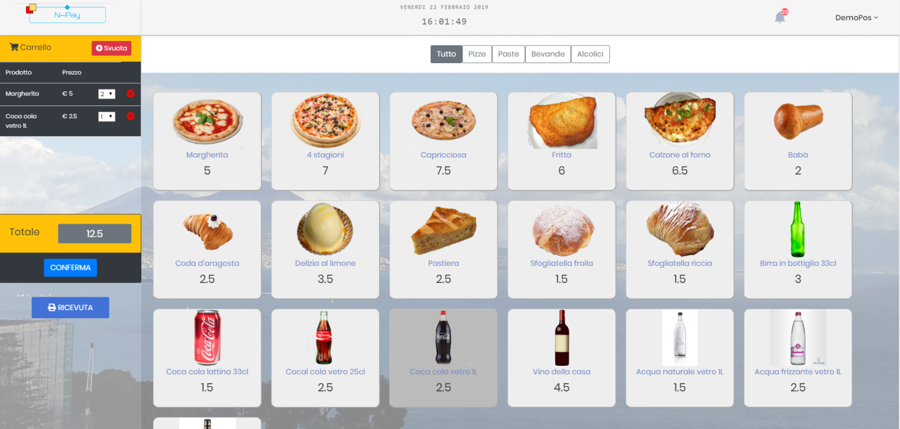

# Napay POS (Point of Sale)

### Progressive Web App - v. 1.0

A POS (Point of sale) is all you need to start earning bitcoins.

## Authors
Made with ❤️ by [Sergio Casizzone](https://sergiocasizzone.it)

**Features**

- [x] Mobile & Desktop Layout
- [x] Bitcoin Transactions list & details
- [x] Token (TTS) Transactions list & details
- [x] Bitcoin (Lightning) & Token receive
- [x] Print receipts

**PWA**

- [x] Service Worker
- [x] indexedDB
- [x] static precache & dynamic cache

## Info

Il POS o Point of Sale (Punto di vendita) è il software con cui il commerciante effettua le vendite al dettaglio. Può essere utilizzato da tutti i dispositivi mobili, smartphone, tablet ed anche da Pc Desktop.

Per comodità di trasporto, si consiglia l’uso di uno smartphone. Se invece si dispone di un PC Desktop nel proprio negozio, può essere consigliabile l’utilizzo della versione desktop. **L’utente non deve impostare assolutamente nulla, è il software che cambia visualizzazione in base al tipo di dispositivo utilizzato.**

## Login

Per accedere, basta cliccare sul pulsante **POS** visibile nel widget di Napay, oppure digitare direttamente l'URL [pos.napoliblockchain.it](https://pos.napoliblockchain.it) nella barra degli indirizzi del browser.

Nella pagina di *Login* inserire il codice identificativo **SIN**.

## **Keypad**

Il Keypad (tastierino numerico), come quello visualizzato nell’immagine sopra, è lo strumento con il quale inseriremo i corrispettivi per la vendita.

Vengono mostrati, per facilità d’uso, il prezzo del bitcoin in euro e la conversione in bitcoin dell’importo della eventuale transazione in bitcoin.

I pulsanti **Bitcoin**  e **Token** contraddistinguono l’acquisizione delle criptovalute tra Bitcoin (Litecoin, ecc.) e il Token sviluppato dal Comune di Napoli.

## **Shopping cart**

Se si accede con un dispositivo desktop o con un iPad al posto del tastierino numerico il software visualizzerà la schermata seguente attraverso la quale sarà possibile cliccare direttamente sul singolo prodotto scelto, suddiviso per categoria merceologica.

