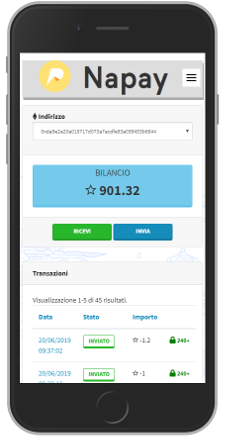

# Napay TTS Wallet

### Progressive Web App - v. 1.2

:heart::heart::heart: A wallet using Naples Payment Token, implementing a lot of PWA love. :heart::heart::heart:

## Authors

- [Sergio Casizzone](https://sergiocasizzone.it)
- [Antonio Della Porta](mailto:antonio@dellaporta.it)

## Features

###### **Wallet**

- [x] Mobile Layout
- [x] `Token` & `Gas` Balance
- [x] Token send & receive
- [x] Gas receive only feature
- [x] Available in English and Italian languages
- [x] Transactions list
- [x] Transaction details
- [x] Select predefined wallet to use
- [x] Blockchain sync & rescan

###### PWA

- [x] Service Worker
- [x] Push messages
- [x] Use of indexedDB
- [x] Static precache & dynamic cache
- [x] Save coin send requests for offline use

[^1]: when the app returns on-line, memorized requests will be executed!

###### Security

- [x] PIN protected access
- [x] Google 2FA Login
- [x] Seed management with recovery wallet
- [x] BIP32 passphrase

## Info

Il **Wallet TTS** è il software con cui il commerciante gestisce i token ricevuti dalle vendite effettuate tramite POS. Trattandosi di un'applicazione web si può utilizzare anche da PC, ma per una migliore esperienza d'uso **si consiglia di utilizzare uno smartphone**.

## Login

Per accedere, basta cliccare sul pulsante **Wallet TTS** visibile nel widget di Napay, oppure digitare direttamente l'URL [wallet.napoliblockchain.it](https://wallet.napoliblockchain.it) nella barra degli indirizzi del browser dello smartphone.

Effettuare il login con le credenziali di accesso all'applicazione **Napay**. Se in **Napay** abbiamo abilitato la **Sicurezza a 2 Fattori per il Wallet TTS** nelle impostazioni utente, non potremo accedere al Wallet finché non avremo inserito il codice di sicurezza richiesto.

## Primo accesso

Se è la prima volta che si effettua l'accesso al wallet, dovremo scegliere se generare un nuovo **seed** oppure inserirne uno già in nostro possesso. Se la scelta è quella di generare un nuovo wallet, scrivere immediatamente le parole del **seed** nello stesso ordine in cui vengono mostrate su un supporto cartaceo e conservarlo in un luogo **sicuro**. In caso di smarrimento, non è più possibile ripristinare e recuperare i fondi presenti su quell'indirizzo. Scaricare e stampare il modello tramite questo link: [Recovery Sheet](RECOVERY_SHEET.pdf)
